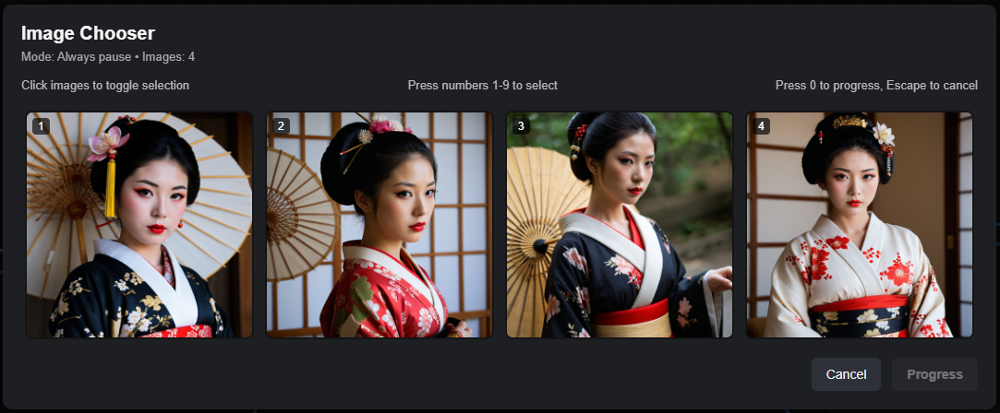

# Image Chooser Classic

A modern re-implementation of the classic [cg-image-picker](https://github.com/chrisgoringe/cg-image-picker) ComfyUI nodes. Keep the workflow-pausing image selection experience while shedding the legacy compatibility shims.

## What’s inside

Install either – or both – of the chooser nodes:

| Node | Description |
|------|-------------|
| **Image Chooser** | Streamlined overlay picker that appears when a workflow pauses. |
| **Image Chooser Classic** | Inline widget that renders thumbnails inside the node body. |

<p align="center">
  
  <br />
  
</p>

## Features

- Accept batched images/latents/masks and return only the chosen subset.
- Supports “progress first pick”, queue cancellation, and familiar hotkeys (`1`–`9`, `0`, `Esc`).
- Rewritten front-end using modern ComfyUI extension APIs.

## Installation

Clone or copy the repository into your `ComfyUI/custom_nodes` folder:

```bash
cd ComfyUI/custom_nodes
git clone https://github.com/heyburns/image-chooser-classic.git
```

Restart (or hard-refresh) ComfyUI so the new JavaScript files load. The **Add Node** dialog will list:

- `Image Chooser`
- `Image Chooser Classic`

> ℹ️ **Good news:** This implementation now posts to its own `/image_chooser_classic_message` endpoint, so it can co-exist with the legacy `cg-image-picker` node. I don't recommend having both (especially since the legacy node no longer works), but if you keep both installed, just make sure each extension is up to date after ComfyUI restarts.

## Usage tips

- **Overlay node** - ideal for large grids or when you want the chooser hovering over the canvas. Plays an optional alert sound when it pauses.
- **Classic node** - keeps everything in the graph. The widget automatically resizes to show the entire batch.
- **Hotkeys** - the chooser listens for 1-9 to toggle thumbnails, 0 to progress/cancel, and Esc to cancel.

## Differences from the original project

- No extraneous build metadata or auxiliary nodes – just the two chooser implementations.
- Front-end logic rewritten around the current ComfyUI extension APIs.
- Small, focused code base that’s easy to extend (styling, additional modes, etc.).

## Contributing

Fork away and adapt these choosers to your workflow. Pull requests are welcome – whether you add screenshots, alternative layouts, or automated tests.

Enjoy choosing images the way you like! ✨
